# ai-agent
This is a repository for agent develop

https://www.runoob.com/ai-agent/ai-agent-tutorial.html

**名词解释**

- ReAct : Reason Act
  - ReAct 是一种让 LLM 交替进行推理和行动的框架，通过让模型显式地展示思考过程来提高复杂任务的解决能力。
- CoT
  - Chain of Thought(思维链)
- ReAct
  - Reasoning + Acting 推理 + 行动循环
- RAG
  - RAG（Retrieval-Augmented Generation，检索增强生成）
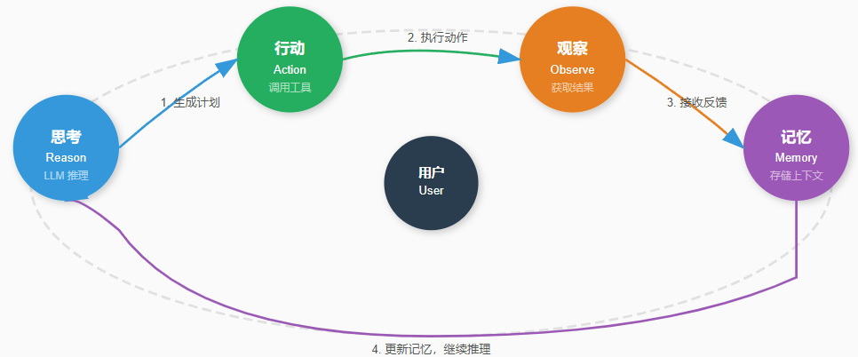
- Transformer
  - 当前大模型核心架构，通过自注意力机制建立 Token 之间关联关系。
- Token
  - 模型处理文本最小单位，可为子词、单词、字符或符号。
- Prompt
  - 给到模型的输入指令，用来设定角色、控制行为、规范输出格式与目标。
- RAG
  - 检索增强生成，先检索外部专业知识库，再交由 LLM 整合生成精准答案。
- MCP
  - 模型上下文协议 ( Model Context protocol )，统一 AI 与工具、数据库、外部服务的通信标准。
- Agent
  - 在 LLM 基础上叠加目标+规划+执行能力的自主智能系统。
- Tool Calling
  - 模型主动识别需求、调用外部工具完成实际操作，不局限纯文本回复。
- Memory
  - 为 AI 提供短期会话记忆 + 长期持久记忆，解决上下文遗忘问题。

## 1.NLP分词办法


|方法|	类型| 	核心思想                    |
|--|--|--|
|词袋法|	文本表示模型| 	统计词频，忽略顺序与语法            |
|TF-IDF|	词袋法的加权改进| 	对词袋进行词频逆文档加权            |
|Word Embedding|	词向量表示| 	将词映射到稠密低维向量空间，捕捉语义      |
|BGE|	通用文本嵌入模型（如 BGE embedding）| 	基于预训练模型（如 BERT）生成句/段向量  |

## 2. Agent的核心组件

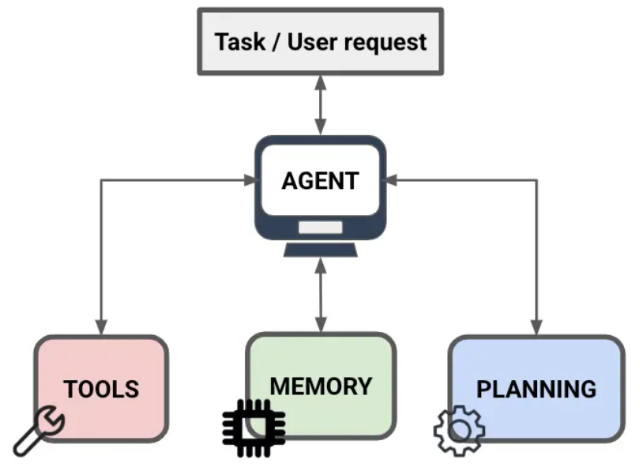

- 大脑
  - 负责听懂任务、判定目标、决定顺序
- 工具
  - 执行任务的操作
- 记忆
  - 记录当前会话出现的认知提高
- 规划
  - 负责将一个大的任务拆分成小的任务

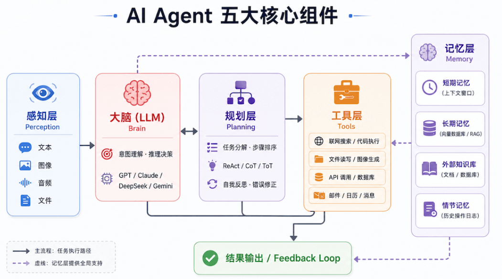


## 3. AI Agent 工作原理

- React 这个 思考 -> 行动 -> 观察 -> 再思考... 的循环，就是 AI Agent 自主完成复杂任务的核心动力机制。

## 4. AI 底层架构

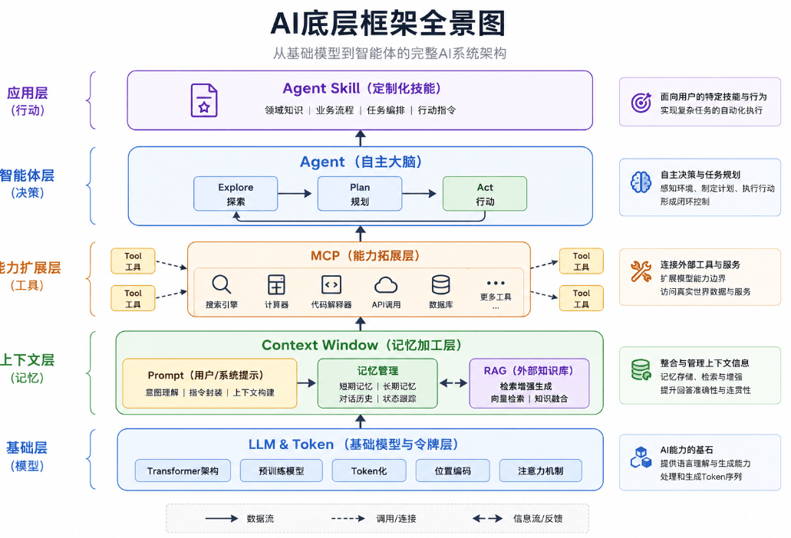

## 5. 大语言模型基础（LLM）

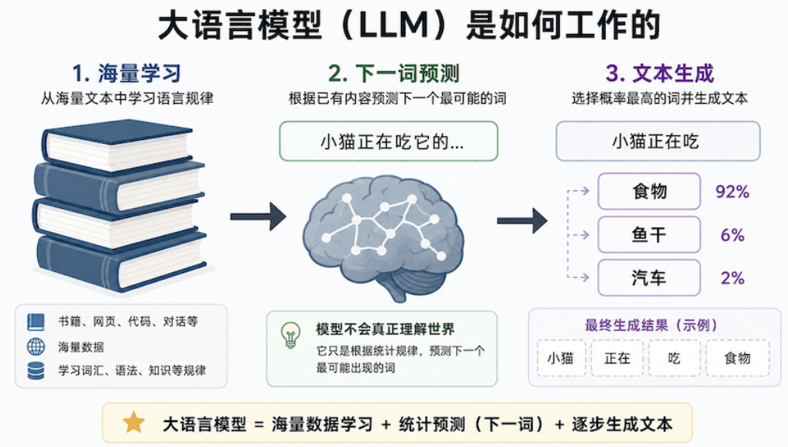

## 6. 提示词工程（Prompt Engineering）

- 提示词工具及案例：
  - https://www.jyshare.com/front-end/9127/

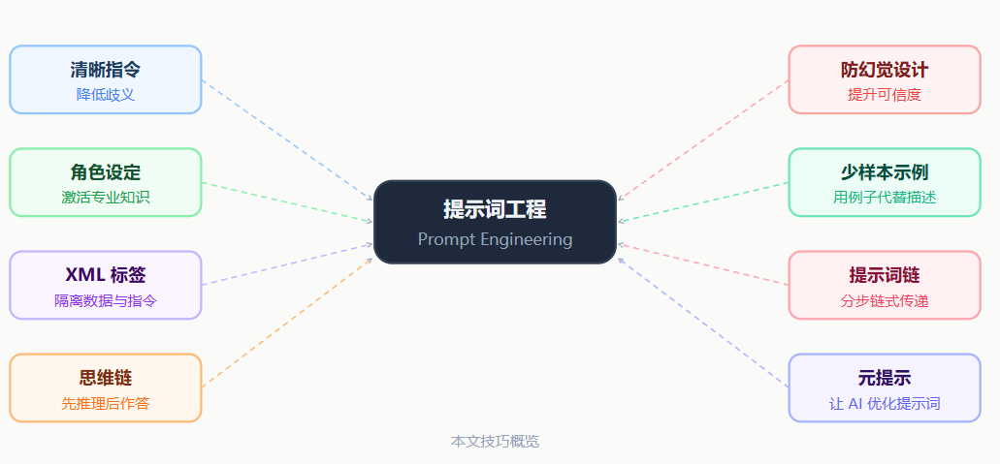

- 三种消息角色
  - System(系统)
    - 设定 AI 的身份、规则和行为准则，在对话开始前生效
  - User(用户)
    - 你每次发出的消息，提出任务或问题
  - Assistant(助手)
    - AI 的回复；也可以预填内容，让 AI 从那里继续

- Token 意识对提示词设计的影响

|场景|	Token 建议|
|--|--|
|System Prompt|	精炼优先，去掉重复说明，核心规则控制在 500 Token 以内|
|输入长文档|	先摘要再输入，或使用 RAG（检索增强）方式只传入相关片段|
|多轮对话|	历史消息会累积消耗 Token，长对话要注意定期"重置"或压缩历史|
|API 开发|	输入 Token + 输出 Token 都计费，输出通常比输入贵 2–3 倍|

**写作建议**：把最重要的指令放在提示词的开头或结尾，中间位置的内容在长上下文中容易被模型"忽视"——这是大模型的已知特性，称为"迷失在中间（Lost in the Middle）"现象。

- 三种触发思维链的方式
- 方式 1：用标签隔离思考过程
```text
请在 <thinking> 中写下你的推理过程，
在 <answer> 中给出最终答案。

<thinking> 中的内容不需要完美，像草稿一样思考即可。
```
- 方式 2：直接要求一步一步来

```text
这道题请一步一步地思考，展示每一步的推导过程。
```

- 方式 3：先列论据再下结论

```text
请先分别列出支持和反对的理由，再给出你的综合判断。
```

## 7. Token (词元)

总结

|概念|	一句话解释|
|--|--|
|Token|	AI 处理文本的最小单位，介于字符和单词之间|
|上下文窗口|	AI 一次能处理的最大 Token 数|
|Token 计费|	API 调用按输入+输出的 Token 总量收费|
|Token 生成|	AI 回复是逐 Token 产生的，越长越慢|

## 8.推理与规划

- 思维链（Chain of Thought, CoT）
  - 思维链（CoT）的核心思想是：强制要求模型在输出最终答案前，先显式地输出中间的推理步骤（Let's think step by step）

**示例:**

```text
# 通过提供包含推理过程的示例，引导模型进行 CoT 推理
prompt = """
问题：罗杰有5个网球。他又买了2罐网球。每罐有3个网球。他现在共有多少个网球？
解答：罗杰一开始有5个网球。2罐网球，每罐3个，共计 2 * 3 = 6 个网球。5 + 6 = 11。答案是11。

问题：食堂有23个苹果。如果他们用掉20个做午餐，又买了6个，现在有多少个苹果？
解答：食堂本来有23个苹果。用掉20个后剩下 23 - 20 = 3 个。又买了6个，现在有 3 + 6 = 9 个。答案是9。

问题：{user_question}
解答："""
```

- ReAct 框架（Reasoning + Acting）推理 + 行动循环
  - 在 ReAct 范式下，Agent 遵循 Thought（思考） -> Action（行动） -> Observation（观察） 的循环，直到得出最终结论。

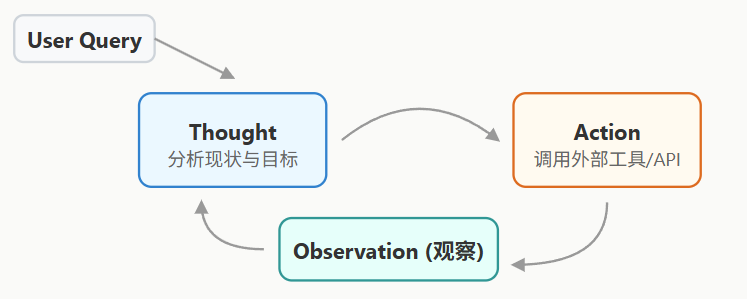

- Plan-and-Execute（规划先行执行模式）
  - 先出排期表，再挨个干活。

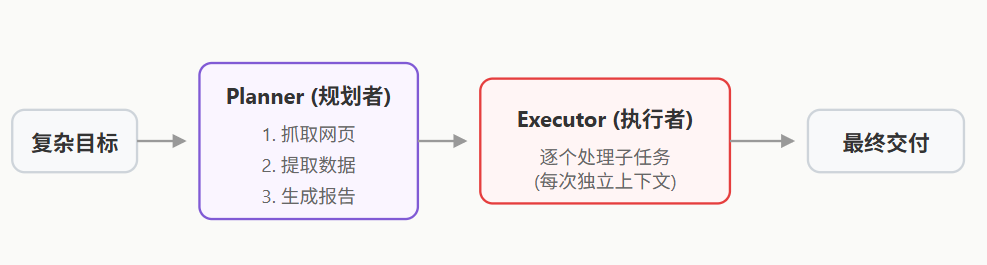

任务分解策略与工程化实践

|干预策略|	核心做法|	适用场景|
|--|--|--|
|子任务模板化 (SOP)|	不让 LLM 自由规划，而是预先定义好标准操作程序（SOP），让 LLM 在固定的状态机（State Machine）中流转。	|客服系统、标准化的数据清洗流水线。|
|HITL (Human-in-the-Loop)|	在 Planner 生成任务列表后，中断执行，要求人类用户进行确认、修改或审批（Approve），然后再交由 Executor 执行。	|高风险操作：如删除数据库记录、发送群发邮件、大额资金转账。|
|RLHF 引导规划|	利用强化学习和人类偏好反馈，专门微调大模型的规划能力，使其更倾向于生成安全、高效的步骤组合。	|底层大语言模型基座的训练阶段（如 OpenAI 的 o1 模型训练）。|


**框架对比总结**

|模式|	核心机制|	优点|	缺点|
|--|--|--|--|
|CoT|	Step-by-Step 线性推理	|实现极简，显著提升基础推理准确度	|无法调用外部工具，容易一条道走到黑|
|ReAct|	交替思考与行动闭环	|动态适应环境，能通过观测实时调整	|上下文容易随步骤累积而爆炸，迷失初衷|
|Plan-and-Execute|	先拆解为子任务，再隔离执行	|极其适合长线复杂任务，上下文清晰	|面对突发变化（规划本身出错时）不够灵活
|ToT / MCTS|	树状搜索，评估回溯	|能解决最高难度的复杂逻辑问题	|计算成本极其高昂，Token 消耗呈指数级|
|Reflexion|	基于失败反馈生成反思记忆|	具备自我纠错和持续进化的能力|	依赖明确的反馈信号（如代码编译器报错）|

## 9.向量数据库（Vector Database）

- 为什么需要向量数据库
  - 传统关系型数据库（MySQL、PostgreSQL）非常擅长处理结构化数据，但在面对以下需求时力不从心：
    - 图片搜索（找出视觉相似的图片）
    - 语义搜索（用户搜"苹果手机"，能找到"iPhone"的相关内容）
    - 推荐系统（找到"和你喜欢的歌曲风格类似的歌"）
    - 异常检测（找到"和正常行为差异最大的日志"）
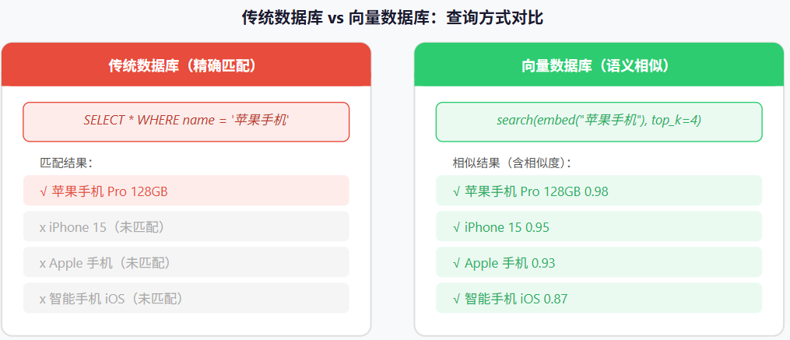


- 核心概念：向量与嵌入(Vector 与 Embedding)
  - Vector: [0.12, -0.54, 0.87, 0.03, ..., 0.61]   ← 这就是一个向量
  - Embedding: 将现实世界的对象（文字、图片、音频等）转换成向量的过程和结果。
- 相似度计算方法
  - 余弦相似度
    - 适用场景：文本语义搜索、文档相似度
  - 欧氏距离
    - 适用场景：图像检索、地理位置相关应用
  - 点积
    - 适用场景：推荐系统（向量已归一化时等价于余弦相似度）
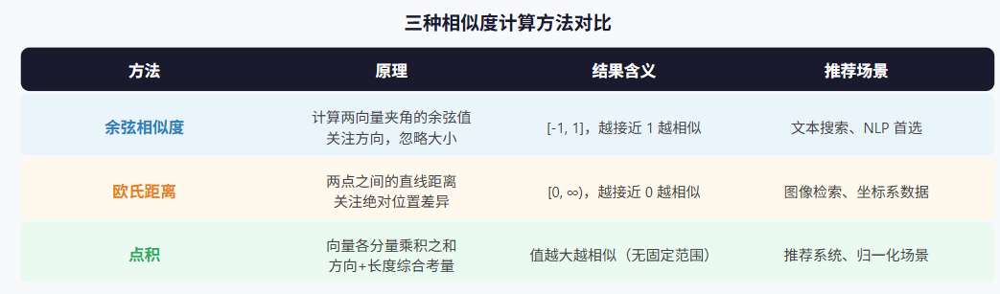

- 向量索引算法
  - 暴力检索（Flat / Brute-force）,O(n) 复杂度
  - IVF（倒排文件索引）训练阶段 -> 查询阶段
  - HNSW（分层导航小世界图）HNSW 是目前最主流的向量索引算法，兼顾速度和精度。

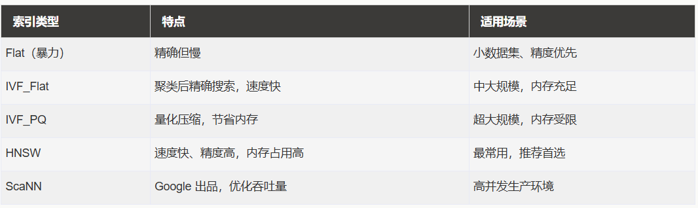

**典型应用场景**
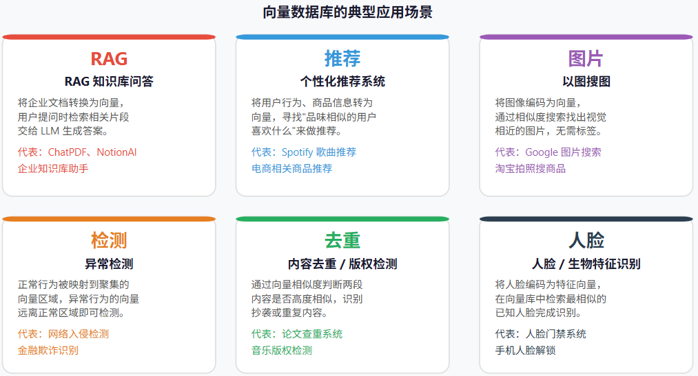

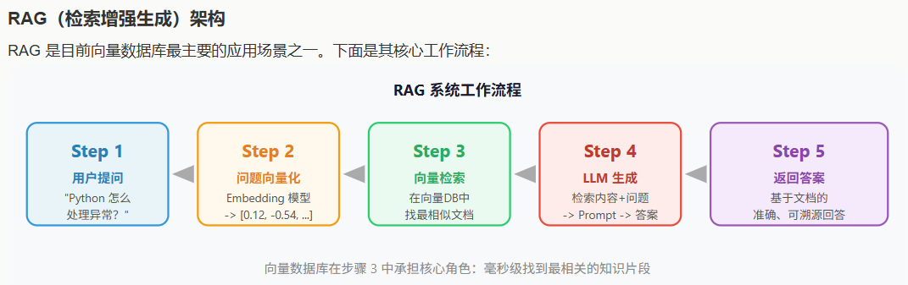

## 10.RAG 与知识检索

- RAG（Retrieval-Augmented Generation，检索增强生成）是目前最主流的 LLM 落地架构之一。
  - RAG 的核心思想是：让 LLM 在回答问题时，先从外部知识库中检索相关内容，再基于检索结果生成回答，而不是仅依赖模型训练时记住的知识。

- RAG 基础原理
  - 一个完整的 RAG 系统由两条流水线组成：离线索引流水线（将文档预处理存入向量库）和在线查询流水线（接收用户问题、检索、生成）
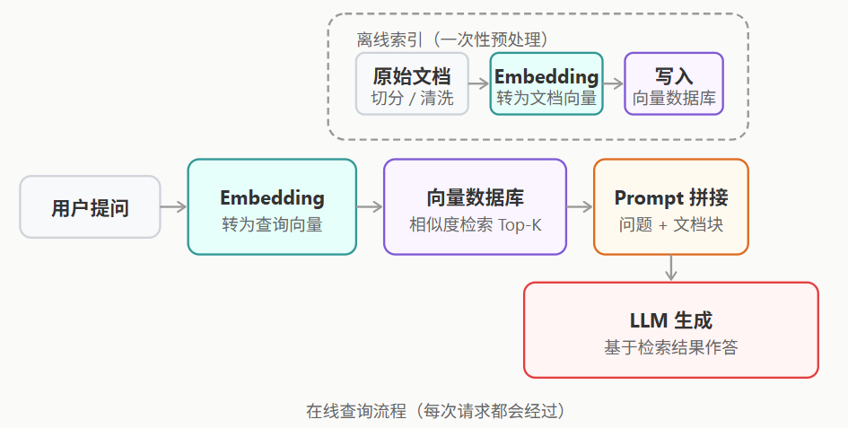

- 数据预处理与文档切分（Chunking）
  - 目前行业主流方案是引入 文档解析引擎（如 LlamaParse、Unstructured）或多模态大模型，将复杂图文转换为结构化的 Markdown，为后续高质量切分打下基础
  - 文档切分策略
    - 文档切分是 RAG 效果的基础，切分粒度直接影响检索质量。块太大会引入噪声，块太小会丢失上下文。常用策略如下：
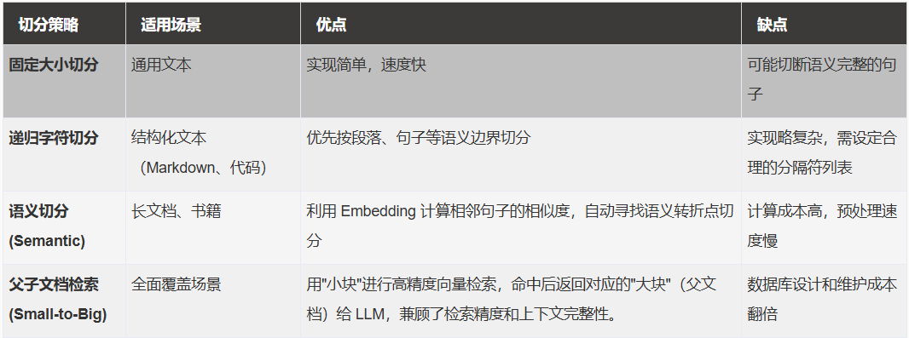

- 向量检索
  - Embedding 模型(Embedding 模型负责将文本转换为稠密向量（通常是 768 或 1536 维的浮点数数组）。语义相近的文本在向量空间中距离更近，这正是相似度检索的数学基础)
    - text-embedding-3-small、text-embedding-3-large、BAAI/bge-m3、sentence-transformers/all-MiniLM-L6-v2
  - 相似度计算与 ANN 算法
    - 余弦相似度、点积（Dot Product）和欧氏距离（L2 Distance）

---

- Advanced RAG (进阶架构)
  - 基础架构（Naive RAG）常面临检索不准确、冗余信息多导致"上下文淹没"等问题。Advanced RAG 通过预检索优化 → 检索融合 → 后检索优化的三段式架构予以解决。
    - 1、预检索：查询优化
    - 2、混合检索（Hybrid Search）
    - 3、后检索优化：重排序（Reranking）
    - 4、Self-RAG 与 CRAG（修正式 RAG）

---

- GraphRAG：知识图谱 + 检索融合
  - GraphRAG 引入知识图谱（Knowledge Graph），将实体和关系显式建模。
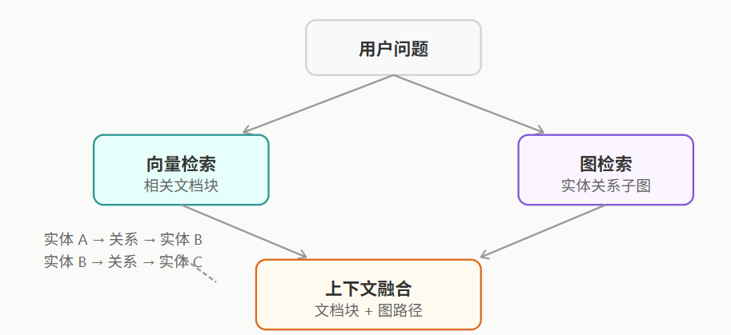
  - GraphRAG 核心步骤
    - 知识构建：离线阶段使用 LLM 从文档提取三元组（主体、关系、客体），写入 Neo4j 等图数据库。 
    - 双路检索：针对提问中的实体，不仅做传统的向量检索，同时在图谱中触发图遍历（Graph Traversal），提取多跳关系链。 
    - 图文融合生成：将向量检索找回的"片段"与图检索找回的"路径结构"拼装进 Prompt，使得 LLM 既具备全局视野又掌握具体细节。

---

- 技术与数据库选型建议

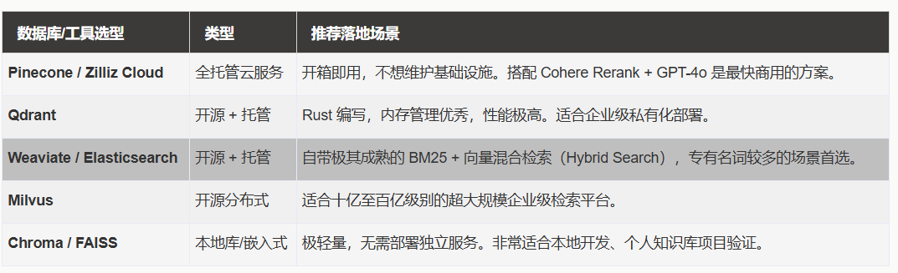

- RAG 评估指标（RAGAS 框架）
  - Context Recall（检索召回率）：标准答案中的信息有多少比例能被检索到。 
  - Context Precision（检索精确率）：检索到的文档中有多少比例是真正相关的。 
  - Faithfulness（忠实度/幻觉指标）：生成的答案是否都有检索出的文档支撑。 
  - Answer Relevance（答案相关性）：生成的答案是否真正回答了用户的问题，避免答非所问。

## 11.Agent 上下文工程

- Agent 上下文工程（Agent Context Engineering）是系统化设计和优化传递给 AI Agent 的上下文信息的技术实践，它的目标是让 Agent 在有限的上下文窗口内获得最有效的信息，从而提升任务执行的准确性、效率和可靠性。
- 上下文工程的核心在于回答一个问题：在这轮调用中，Agent 最需要知道什么
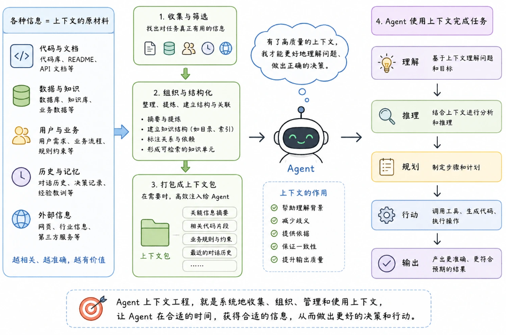
- 核心要素
  - 系统提示（System Prompt）
  - 工具定义（Tool Definitions）
  - 历史记录（History）
  - 检索上下文（Retrieved Context）
  - 用户输入（User Input）
- 相关概念

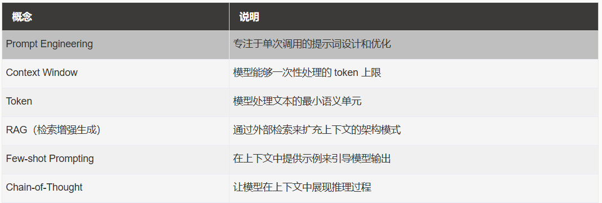

## 12.Agent 架构

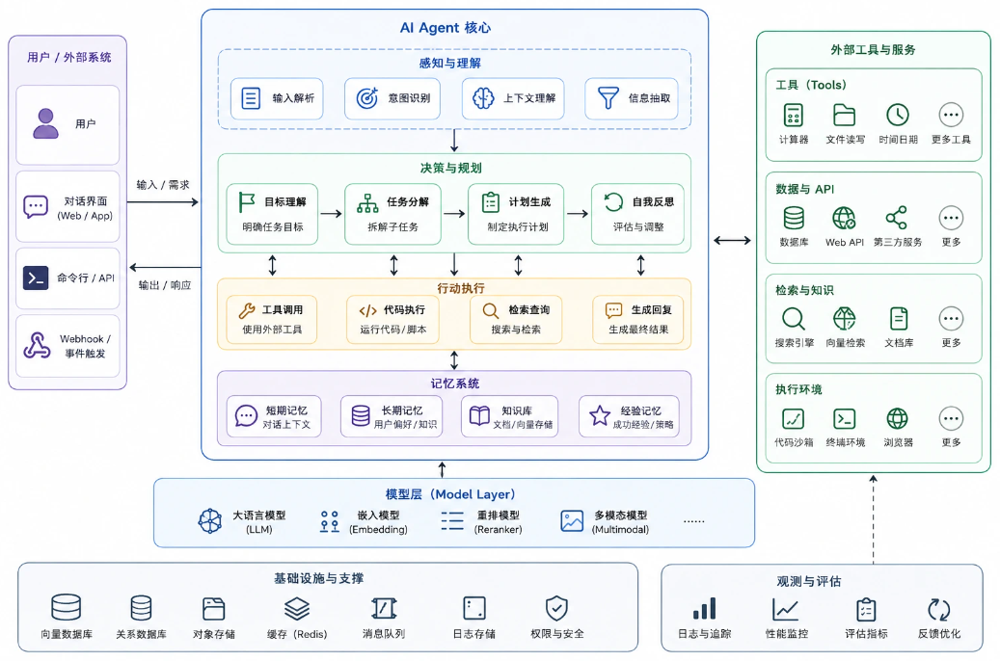

- 什么是 Agent 架构
  - Agent 架构是指 Agent 系统中各个组件的组织方式，决定了 Agent 的能力边界、可靠性、灵活性和适用场景。
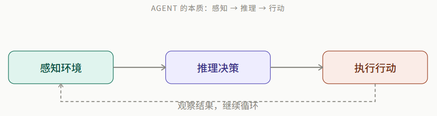
  - Agent 的工作方式本质上是一个循环（Loop）——感知当前状态，推理下一步，执行行动，再次感知……直到任务完成。 不同架构的差异，就在于如何组织和扩展这个基本循环。

- 架构一：单 Agent 循环（Single Agent Loop）
  - 单 Agent 循环直接体现了 ReAct 模式（Reasoning + Acting）：每一步都是"先想再做"。LLM 充当大脑，工具调用是它的双手。
    - 工作原理
      - 感知：读取当前状态——文件内容、环境变量、之前步骤的输出结果，整合成当前上下文。
      - 推理：LLM 根据上下文决定下一步动作——调用哪个工具、传入什么参数，或者判断任务是否已完成。
      - 行动：执行工具调用，例如读写文件、搜索网络。工具的执行结果会被追加到上下文中，进入下一轮循环。
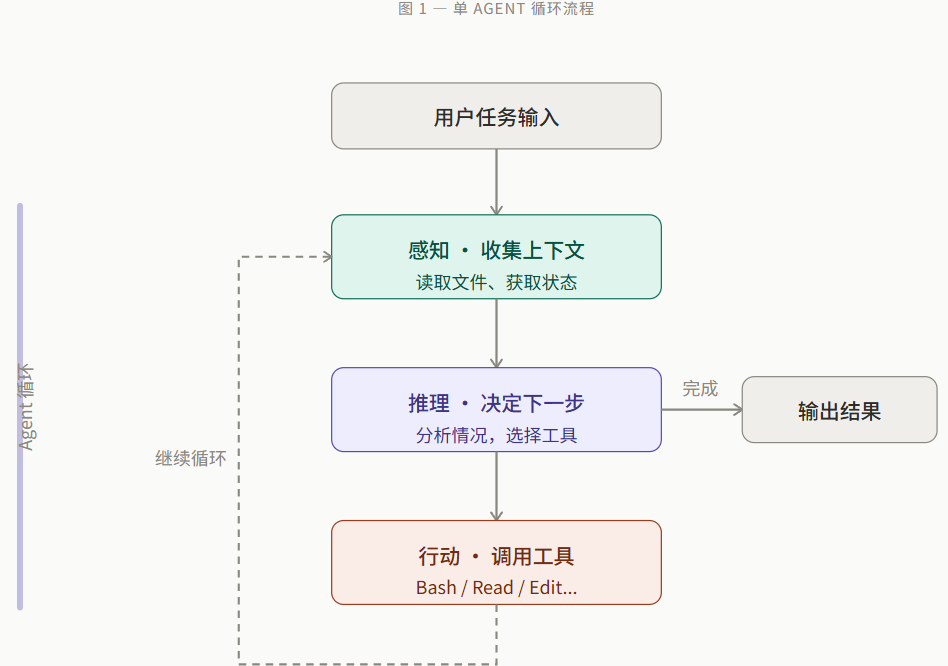
- 架构二：规划 + 执行（Plan & Execute）
  - 将"想清楚要做什么"和"实际去做"分离为两个独立阶段，提升任务的可预测性和可审计性。
  - 分为静态规划和动态规划两种实现
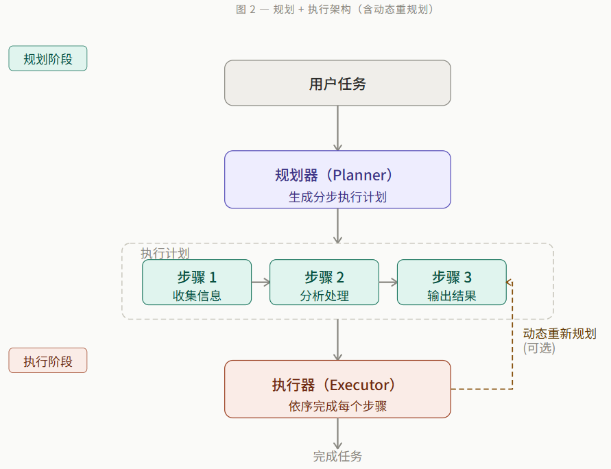

- 架构三：多 Agent 协作（Multi-Agent）
  - 一个 Orchestrator（协调者）负责任务拆解和调度，多个 Subagent 各司其职，并行或串行地完成子任务，结果汇聚回 Orchestrator 做综合。
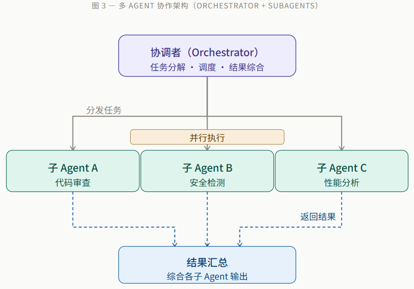

- 架构四：反思与自我修正（Reflection）
  - 在 Agent 的输出环节加入质量评估，不满意则重新生成或修正，形成内部迭代循环。
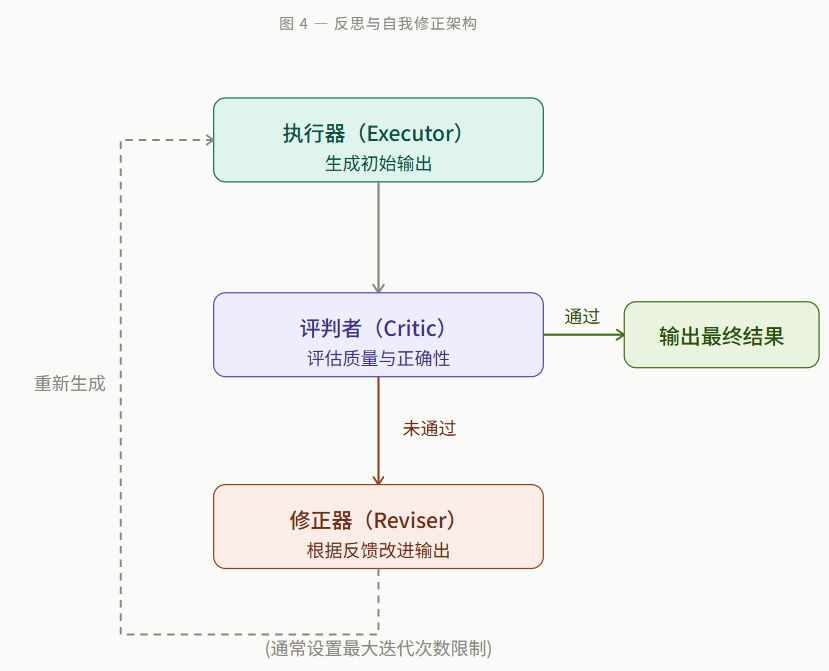

- 架构五：RAG + Agent（检索增强型智能体）
  - RAG（Retrieval-Augmented Generation，检索增强生成）本是一种让 LLM 查询外部知识库的技术。当它与 Agent 结合时，变得更加强大：Agent 可以主动决定何时检索、检索什么，而不是每次都被动地检索一次。
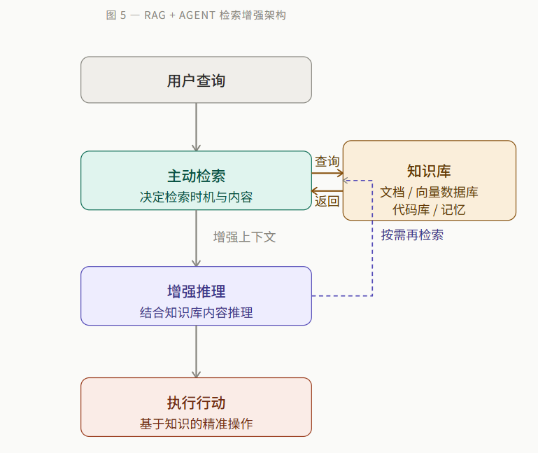

- 架构六：工作流编排（Workflow / DAG）
  - 把 Agent 行为固化为一张有向无环图（DAG），每个节点是一个 LLM 调用或工具调用，边表示数据依赖关系，由框架驱动执行。
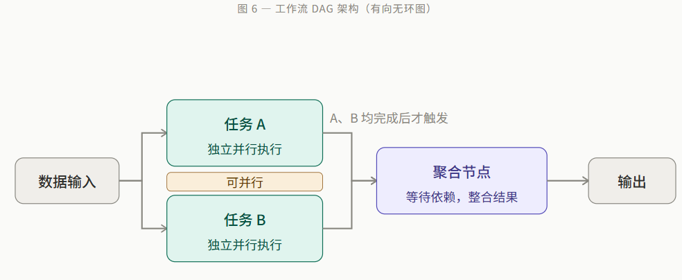

- 横向对比与如何选择
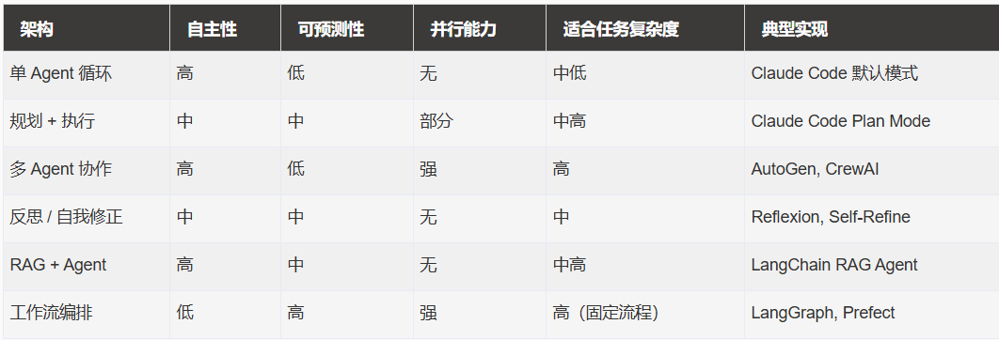

- 常见组合模式
  - 工作流编排 + 多 Agent
    - 用 DAG 定义主流程，每个节点内部是一个独立的 Agent。例如 CI/CD 流水线中，代码检查节点是 Code Review Agent，安全扫描节点是 Security Agent。
  - 多 Agent + RAG
    - 多个 Subagent 共享同一个向量知识库，各自根据子任务按需检索。例如客服系统中，订单查询 Agent 和退款处理 Agent 都查询同一个知识库但检索不同的内容。
  - 规划执行 + 反思
    - 先规划再执行，但每个步骤执行后加入反思环节确保质量。适合对质量要求极高的任务。

## 13.Harness Engineering（驾驭工程）

- Harness Engineering（驾驭工程）是围绕 AI 智能体设计和构建约束机制、反馈回路、工作流控制和持续改进循环的系统工程实践。 
- 它不优化模型本身，而是优化模型运行的环境。核心哲学八个字：人类掌舵，智能体执行（Human Steer, Agent Execute）。

- 驾驭工程的四大护栏
  - 上下文工程（Context Engineering）
  - 架构约束（Architecture Constraints）——缰绳
  - 反馈循环（Feedback Loop）——智能体审智能体
  - 熵管理（Entropy Management）——垃圾回收
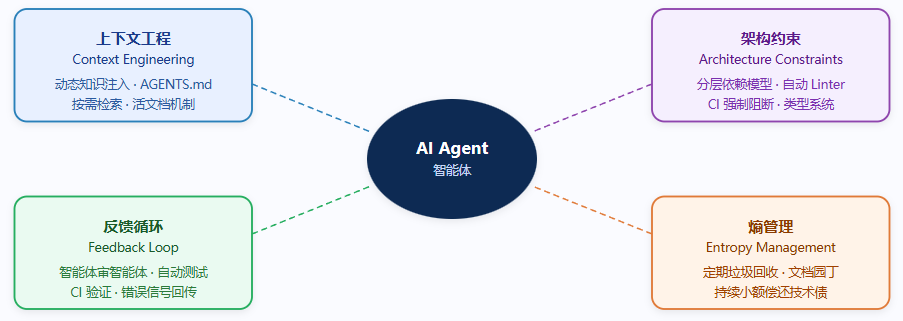
- Harness 与传统框架的关系
  - Harness 不是 SDK、脚手架或 Agent 框架的替代品，而是位于它们之上的一层
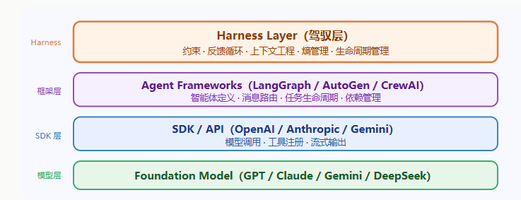

## 14.Hermes Agent

- Hermes Agent 是 Nous Research 开源的自主 AI Agent 框架
  - GitHub 仓库
    - https://github.com/nousresearch/hermes-agent
  - Hermes Agent 官网
    - https://hermes-agent.nousresearch.com/